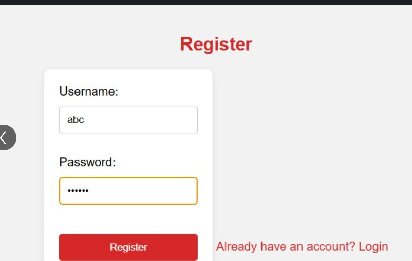
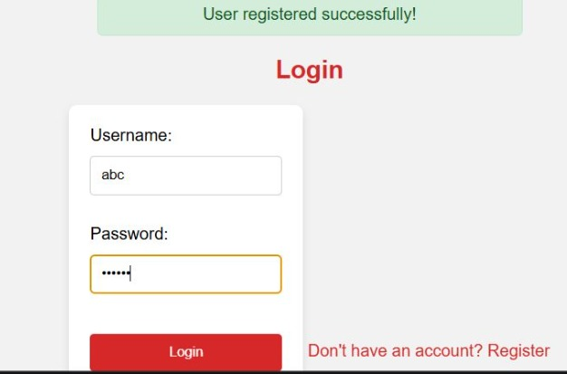
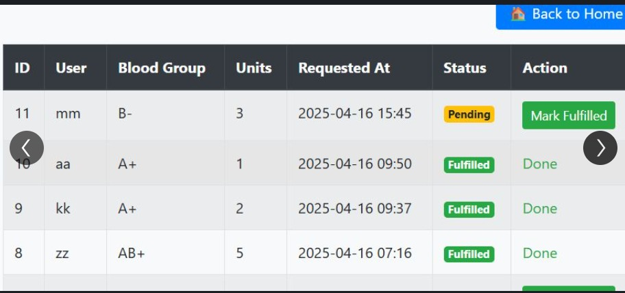

# 🩸 Blood Bank Management System

<p align="center">
  <b>A web-based Blood Bank Management System built using Django and SQLite.</b>
</p>

<p align="center">
  
  
  
  
</p>

---

## 📌 About The Project

**Blood Bank Management System** is a web-based application developed using **Django and SQLite** to simplify blood request management.

The system allows users to register and log in, submit blood requests, and track the status of their requests through a centralized web application.

The project demonstrates the use of **Django web development, database management, user authentication, and request tracking** in a healthcare-oriented application.

---

## 🎯 Objectives

- 🩸 Simplify blood request management
- 👤 Provide user registration and login functionality
- 📝 Allow users to submit blood requests
- 📊 Allow users to track their request status
- 🗄️ Store application data using SQLite
- 🌐 Provide a simple and user-friendly web interface
- ⚙️ Demonstrate Django-based web application development

---

## ✨ Key Features

### 👤 User Registration

Users can create an account by providing the required registration details.

### 🔐 User Login

Registered users can securely log in to access the application.

### 🩸 Blood Request

Users can submit requests for the required blood type through the application.

### 📋 Request Tracking

Users can view and track the status of their submitted blood requests.

### 🗄️ Database Management

The application uses SQLite to store and manage application data.

### 🌐 Web-Based Interface

The system provides a browser-based interface for interacting with the blood bank management features.

---

## 🔄 System Workflow

```text
              ┌──────────────────┐
              │       User       │
              └────────┬─────────┘
                       │
                       ▼
              ┌──────────────────┐
              │ Register / Login │
              └────────┬─────────┘
                       │
                       ▼
              ┌──────────────────┐
              │ User Dashboard   │
              └────────┬─────────┘
                       │
                       ▼
              ┌──────────────────┐
              │ Submit Blood     │
              │ Request          │
              └────────┬─────────┘
                       │
                       ▼
              ┌──────────────────┐
              │ Request Stored   │
              │ in Database      │
              └────────┬─────────┘
                       │
                       ▼
              ┌──────────────────┐
              │ Track Request    │
              │ Status           │
              └──────────────────┘
```
# 🩸 Blood Bank Management System

<p align="center">
  <b>A web-based Blood Bank Management System built using Django and SQLite.</b>
</p>

<p align="center">
  
  
  
  
</p>

---

## 📌 About The Project

**Blood Bank Management System** is a web-based application developed using **Django and SQLite** to simplify blood request management.

The system allows users to register and log in, submit blood requests, and track the status of their requests through a centralized web application.

The project demonstrates the use of **Django web development, database management, user authentication, and request tracking** in a healthcare-oriented application.

---

## 🎯 Objectives

- 🩸 Simplify blood request management
- 👤 Provide user registration and login functionality
- 📝 Allow users to submit blood requests
- 📊 Allow users to track their request status
- 🗄️ Store application data using SQLite
- 🌐 Provide a simple and user-friendly web interface
- ⚙️ Demonstrate Django-based web application development

---

## ✨ Key Features

### 👤 User Registration

Users can create an account by providing the required registration details.

### 🔐 User Login

Registered users can securely log in to access the application.

### 🩸 Blood Request

Users can submit requests for the required blood type through the application.

### 📋 Request Tracking

Users can view and track the status of their submitted blood requests.

### 🗄️ Database Management

The application uses SQLite to store and manage application data.

### 🌐 Web-Based Interface

The system provides a browser-based interface for interacting with the blood bank management features.

---

## 🔄 System Workflow

```text
              ┌──────────────────┐
              │       User       │
              └────────┬─────────┘
                       │
                       ▼
              ┌──────────────────┐
              │ Register / Login │
              └────────┬─────────┘
                       │
                       ▼
              ┌──────────────────┐
              │ User Dashboard   │
              └────────┬─────────┘
                       │
                       ▼
              ┌──────────────────┐
              │ Submit Blood     │
              │ Request          │
              └────────┬─────────┘
                       │
                       ▼
              ┌──────────────────┐
              │ Request Stored   │
              │ in Database      │
              └────────┬─────────┘
                       │
                       ▼
              ┌──────────────────┐
              │ Track Request    │
              │ Status           │
              └──────────────────┘

```
🏗️ Application Architecture
```

┌───────────────────────────────┐
│            User               │
│       Web Browser             │
└───────────────┬───────────────┘
                │
                ▼
┌───────────────────────────────┐
│       Django Application      │
│                               │
│  • Authentication             │
│  • Blood Requests             │
│  • Request Tracking           │
│  • Application Logic          │
└───────────────┬───────────────┘
                │
                ▼
┌───────────────────────────────┐
│          SQLite               │
│          Database             │
└───────────────────────────────┘

```
🛠️ Technologies Used
Backend
Python
Django
Frontend
HTML
CSS
Django Templates
Database
SQLite
Development Tools
Git
GitHub
Visual Studio Code

📂 Project Structure
```

BloodBank-Management-System/
│
├── bloodbank/
│   ├── migrations/
│   ├── templates/
│   ├── static/
│   └── ...
│
├── donations/
│   ├── migrations/
│   └── ...
│
├── db.sqlite3
├── manage.py
├── requirements.txt
└── README.md

```
⚙️ Installation & Setup
1️⃣ Clone the Repository
git clone https://github.com/Aiswarya-RS/BloodBank-Management-System.git

Navigate to the project directory:

cd BloodBank-Management-System
2️⃣ Create a Virtual Environment
python -m venv venv

Activate the virtual environment.

Windows
venv\Scripts\activate
Linux / macOS
source venv/bin/activate
3️⃣ Install Dependencies
pip install -r requirements.txt
4️⃣ Apply Database Migrations
python manage.py migrate
5️⃣ Start the Development Server
python manage.py runserver

Open the local development URL provided by Django in your browser.

🔄 Application Flow

```
User Registration
        │
        ▼
     Login
        │
        ▼
   User Dashboard
        │
        ▼
 Blood Request
        │
        ▼
Request Information
        │
        ▼
 Database Storage
        │
        ▼
Request Status Tracking

```

🗄️ Database

The project uses SQLite as its database.

SQLite is used to store application information required for user management and blood request processing.

The repository includes the project's SQLite database file:

db.sqlite3
📋 Main Modules
👤 User Management

Handles user registration and authentication.

🩸 Blood Request Management

Allows users to submit blood requests.

📊 Request Tracking

Provides users with the ability to monitor the status of their requests.

🗄️ Database Management

Stores and retrieves application data using SQLite.

🚀 Future Enhancements
🩸 Add real-time blood inventory tracking
🏥 Add hospital management functionality
👨‍⚕️ Add separate donor, recipient, and administrator roles
📍 Add location-based blood availability
🔔 Add notifications for blood request updates
📊 Add an administrator dashboard
📈 Add blood inventory analytics
📱 Develop a mobile application
☁️ Deploy the application to the cloud
🔐 Improve authentication and application security
🎓 Project Highlights

This project demonstrates practical experience with:

Python Programming
Django Framework
Web Application Development
User Authentication
CRUD Operations
Database Management
SQLite
Django Templates
Healthcare Application Development
👩‍💻 Author
Aiswarya R S

Computer Science Engineering Student | Java Developer | AI Enthusiast

<p align="center"> <a href="https://github.com/Aiswarya-RS">  </a> <a href="https://www.linkedin.com/in/aiswarya-r-s-a65a19374/">  </a> <a href="mailto:aiswaryaram025@gmail.com">  </a> </p>
⭐ Project Repository
<p align="center"> <a href="https://github.com/Aiswarya-RS/BloodBank-Management-System">  </a> </p>
⚠️ Disclaimer

This project is developed for educational and academic purposes.

The application is intended to demonstrate the use of Django and database technologies for managing blood request information. It should not be used as a production healthcare or emergency blood-management system without appropriate validation, security, and professional oversight.

# 📸 Screenshots

### 📝 User Registration



---

### 🔐 User Login



---

### 🩸 User Dashboard


---

### 📋 Blood Request Management



---
